= Florilege

== Application goal

The Florilege TDM use case is aimed at microbiologists doing research on bacteria present in food. These researchers need to get information on a specific taxon, in which habitats it can be found in and the phenotypes it can exhibit. Such information enables to design experiments to study a specific taxon in detail. They may also be concerned by a specific habitat and search for a list of taxa that can be found in this habitat. This type of data is mostly stored in scientific publications rather than stored in databases. Hence, the Florilege application may be of use in the process of experiment design, speeding up the collection of taxa to be studied in a specific habitat.

The integration of a TDM module aims at improving the data discovery, and at assisting users in their literature reviews. The TDM module will provide normalization of unstructured entities and enhanced search capabilities. Here analysis means not only the extraction of the relevant spans of text, but also the normalization or categorization with reference resources (e.g. NCBI taxonomy).

== Application description

Data from several sources have been text mined and are indexed and exposed through the Florilege search engine.

This version of the text mining results of scientific publications consists of the automatic recognition and normalization of 1,6 million microorganism taxa and their 3,6 millions habitats and the automatic identification of 3,63 millions relationships between them. The corpus is composed of 1,16 million PubMed references. The taxa are normalized according to NCBI taxonomy. The habitats are normalized according to the http://agroportal.lirmm.fr/ontologies/ONTOBIOTOPE[OntoBiotope Ontology].

Fields of the DSMZ, GenBank and CIRM databases of entries about microbes have been text-mined and result in 100K relations.

// [TODO:] describe corpus & results. cf https://migale.jouy.inra.fr/redmine/projects/uc-as-c-food-microbio/wiki/Data

== User profile

The user of the Florilege application is a microbiologist interested in getting exhaustive information on the habitats and phenotypes of a bacterial taxon.

== Architecture of the application

The relevant corpus has been fully pre-processed by AlvisNLP pipeline and indexed for query through the Florilege application available from any web browser.

== User manual, How-to
=== Launching the application

The application is accessible at the address http://migale.jouy.inra.fr/Florilege/[http://migale.jouy.inra.fr/Florilege/].

[[img-sunset]]
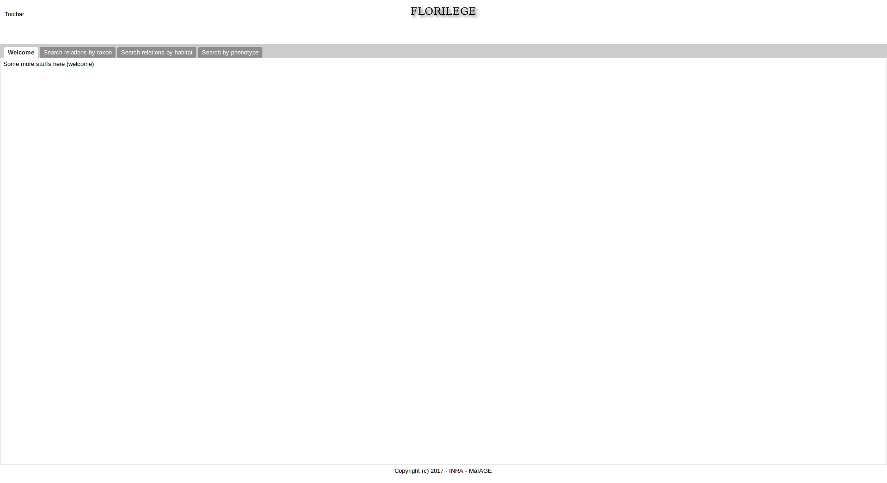

=== Query
//.Homepage//

The user may search in three tabs, depending on the focus on taxa, habitats or phenotypes. 

A query has to be entered in the search box

[[img-sunset]]
//.Search box//
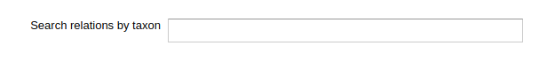

Auto-completion is made with suggestion from the list of synonyms of entities indexed in the database. Once a suggestion is selected using up and down arrows followed by __enter__ or by clicking on it, the query is executed by the search engine.

[[img-sunset]]
//.Autocompletion//
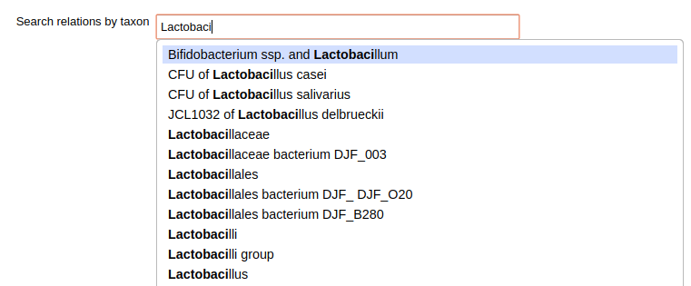

Taxa and habitats appear in relations following the pattern "__Taxon__ lives_in __Habitat__".

Entering a taxon, __e.g.__ "Lactobacillus" in the  "Search by taxon" tab corresponds to a query such as "In which habitat is __Lactobacillus_ found?".

Similarly, entering an habitat in the "Taxon lives in Habitat" tab, such as "cheese" correspond to querying "Which taxon is found in __cheese__?".

//Identically, entering a Taxon in the search box of the "Taxon exibits Phenotype" tab correspond to querying "Which phenotypes does the taxon exhibit" and searching using in the "Phenotype is exhibited by Taxon" tab 

=== Results

The result page contains entries corresponding to annotations of a relation between the searched entity and other named-entities.

[[img-sunset]]
//.Results cheese//
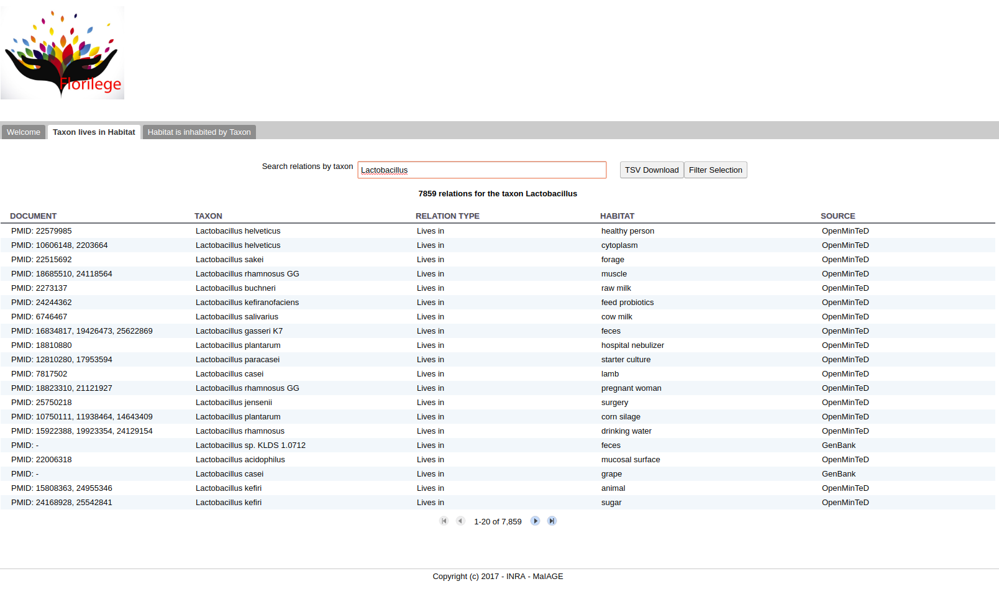

Columns include the following information:

- identifier of the source text in which the annotation was predicted. The identifier is the identifiers used in the source database (PMID for Pubmed documents, DSMZID for DSMZ data, GenBankID for GenBank data). The identifier or list of identifiers are clickable and directs to the notices in the source database

// and CIRM id for CIRM data

[[img-sunset]]
//.PMID clickable//
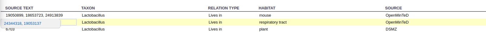

[[img-sunset]]
//.DSMZID clickable//
image::images/florilege-dsmzid-clickable.png[]

[[img-sunset]]
//.GenBankID clickable//
image::images/florilege-genbankid-clickable.png[]

//[[img-sunset]]
//.CIRMID clickable//
//image::images/florilege-cirmid-clickable.png[]

- canonical form of the entity with which the queried entity is in relation

[[img-sunset]]
//.Canonical form//
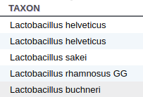

Clicking on the canonical form of an entity displays a popup with the list of surface forms that the entity takes in the source documents. Each annotation may have been predicted several times, which results in lists in the different entries. The list is clickable and points to the NCBI taxonomy entry of the taxon.

[[img-sunset]]
//.Surface form/
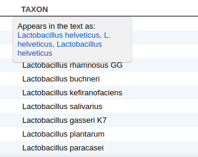

//points to Ontobiotope Habitat

Three filters are available and can be combined or used separately. The filters are displayed when the "Filter Selection" button.

[[img-sunset]]
//.Filtering//
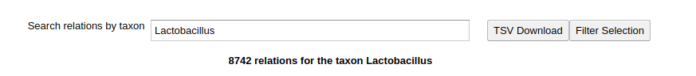

The three filtering parameters are:

- source filtering. Sources can be combined using Ctrl+click

[[img-sunset]]
//.Filter source//
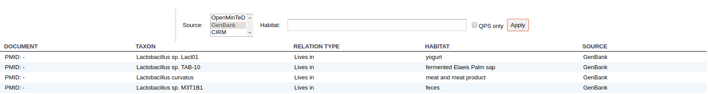

- Second entity filtering. 

[[img-sunset]]
//.Second entity filtering//
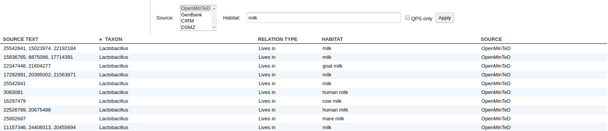

- QPS filtering

[[img-sunset]]
//.Filter QPS//
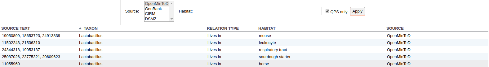

The "TSV Download" enables to download of the results in TSV.

[[img-sunset]]
//.Download button//
image::images/florilege-download-button.png[]

[[img-sunset]]
//.Download results//
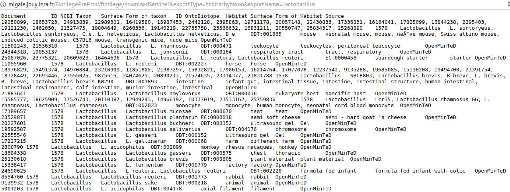

=== Hierarchical search

The results of each query contain the annotations of this entity and the entities that are children of this class in the ontology. For example, searching __firmicutes__returns all occurences of __firmicutes__ in the abstracts as well as occurences of bacteria that are children of __firmicutes__ in the NCBI taxonomy.

//[[img-sunset]]
//.Hierarchical results//
//image::images/florilege-hierarchical.png[]

=== Synonyms handling

Querying can be done using controlled terms of the ontologies as well as surface forms of the terms as used in the original journal articles and databases.

The normalization of terms done in the processing of the data makes that results correspond to a request using the canonical term.

=== URL

The parameters contained in the URLs make it possible to bookmark a result and access it again later.

For example, requesting "Lactobacillus" in the "Taxon lives in Habitat" tab gives the following URL:

http://migale.jouy.inra.fr/Florilege/#&searchByTaxon=Lactobacillus

TSV exports can also be bookmarked, as they result in a URL in the form of:

http://migale.jouy.inra.fr/FlorilegePreProd/florilege/downloadService?&exportType=habitatbytaxon&exportName=Lactobacillus  

//http://migale.jouy.inra.fr/Florilege/florilege/downloadService?&exportType=habitatbytaxon&exportName=Lactobacillus

Note that you need a browser with javascript enabled, so direct downloading from the command line is not possible.

=== Further information

This application and the semantic search engine developed for the first release may be used in association. Documentation of the semantic search engine can be found <<web_app_doc.adoc#, here>>.

