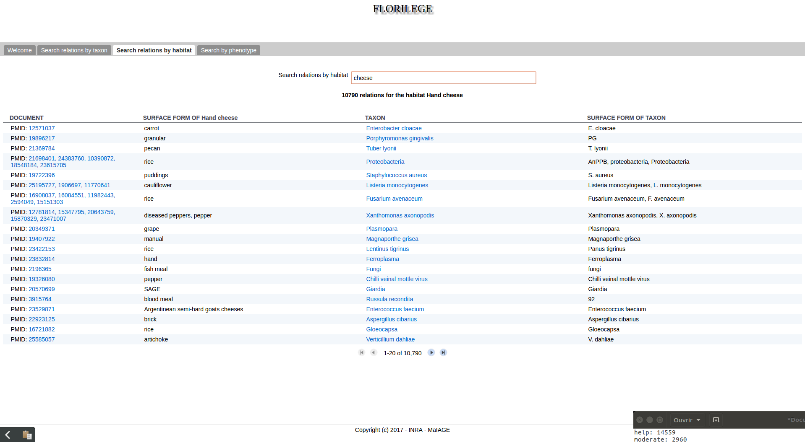
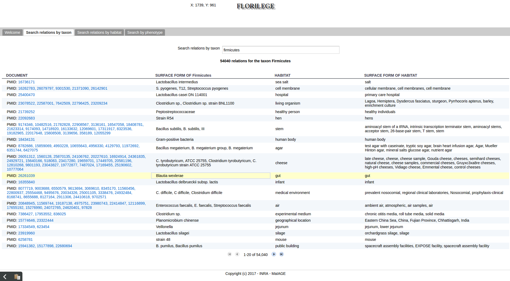

= Florilège

== Application goal

The Florilège TDM use case is aimed at microbiologists doing research on bacteria present in food. These researchers need to get information on a specific taxon, the habitats it can be found in and the phenotypes it can exhibit. Such information enables to design experiments to study a specific taxon in detail. They may also be concerned by a specific habitat and search for a list of taxa that can be found in this habitat. This type of data is mostly stored in scientific publications rather than stored in databases. Hence, the Florilège application may be of use in the process of experiment design, speeding up the collection of taxa to be studied in a specific habitat.

The integration of a TDM module aims at improving the data discovery, and at assisting users in their bibliography search. The TDM module will provide normalization of unstructured entities and enhanced search capabilities. Here analysis means not only the extraction of the relevant spans of text, but also the normalization or categorization with reference resources (e.g. NCBI taxonomy).

== Application description

This version of the application consists of the automatic recognition and normalization of 1,6 million microorganism taxa and their 3,6 millions habitats and the automatic identification of 3,63 millions relationships between them. The corpus is composed of 1,16 million PubMed references. The taxa are normalized according to NCBI taxonomy. The habitats are normalized according to OntoBiotope Ontology. The data is indexed in the Florilège database and can be accessed using the Florilège web interface.

== User profile

The user of the Florilège application is a microbiologist interested in getting exhaustive information on the habitats and phenotypes of a bacterial taxon.

== Architecture of the application

The relevant corpus has been fully pre-processed by AlvisNLP pipeline and indexed for query through the Florilège application available from any web browser.

== User manual, How-to
=== Launching the application

The application is accessible at the address http://genome.jouy.inra.fr/Florilege/.

[[img-sunset]]
//.Homepage//
image::images/florilege-homepage.png[]

=== Query

The user may search in three tabs, depending on the focus on taxa, habitats or phenotypes. 

A query has to be entered in the search box

[[img-sunset]]
//.Search box//
image::images/florilege-search-box.png[]

Auto-completion is made with suggestion from the list of synonyms of entities indexed in the database. Once a suggestion is selected using up and down arrows followed by __enter__ or by clicking on it, the guery is executed by the search engine.

[[img-sunset]]
//.Autocompletion//
image::images/florilege-auto-completion.png[]

Taxa and habitats appear in relations following the pattern "__taxon__ lives_in __habitat__".

Entering a taxon, __e.g.__ "firmicutes" in the  "Search by taxon" tab corresponds to a query such as "In which habitat is __firmicutes__ found?".

Similarly, entering an habitat, such as "cheese" correspond to querying "Which taxon is found in __cheese__?".

Phenotypes predictions are only entities predictions.

Hence, entering a query in the "Search by phenotype" tab, __e.g.__ "acetic acid resistant" correspond to querying "Which surface form does the phenotype __acetic acid resistant__ have in the literature?".

=== Results

The result page contains entries corresponding to annotations of a relation between the searched entity and other named-entities.

Columns include the following information:

- PMIDs of the abstracts in which the annotation was predicted. The PMID or PMID list is clickable and directs to the notices in PubMed
- surface form(s) of the queried entity, as it appears in the text of the abstract
- normalized form of the entity with which the queried entity is in relation
- surface form(s) of the entity with which the queried entity is in relation

Each annotation may have been predicted several times, which results in lists in the different entries.

[[img-sunset]]
//.Results cheese//

=== Search by taxon results

The columns specific to the "Search by taxon" results page are:

- surface form(s) of the taxon that was queried
- normalized form of the habitat in which the taxon may live
- surface form(s) of the habitat, as they appear in the abstract

=== Search by habitat results

The columns specific to the "Search by habitat" results page are:

- surface form(s) of the habitat that was queried
- normalized form of the taxa that live in this habitat. This entry is clickable and directs to the NCBI taxonomy entry of the corresponding taxon
- surface form(s) of the taxon, as they appear in the abstract

=== Search by phenotype results

The columns specific to the "Search by habitat" results page are:

- normalized form of the phenotype
- surface form(s) of the phenotype, as it appears in the literature

=== Hierarchical search

The results of each query contain the annotations of this entity and the entities that are children of this class in the ontology. For example, searching __firmicutes__returns all occurences of __firmicutes__ in the abstracts as well as occurences of bacteria that are children of __firmicutes__ in the taxonomy. 

[[img-sunset]]
//.Hierarchical results//

=== Further information

This application and the semantic search engine developed for the first release will be connected in the next release. Documentation of the semantic search engine can be found <<web_app_doc.adoc#, here>>.

