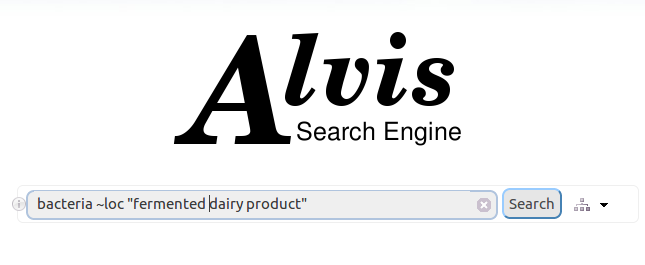
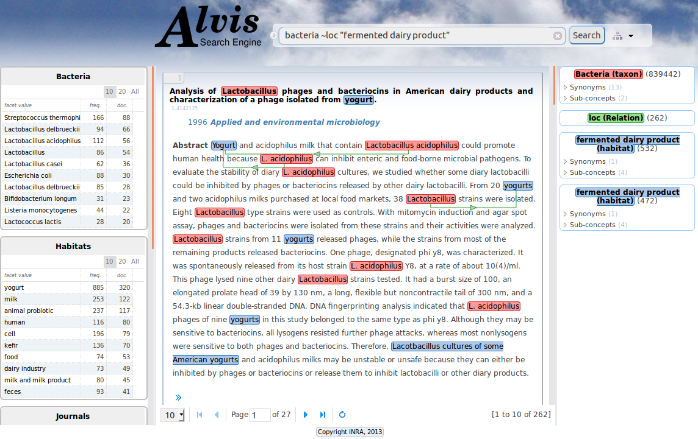
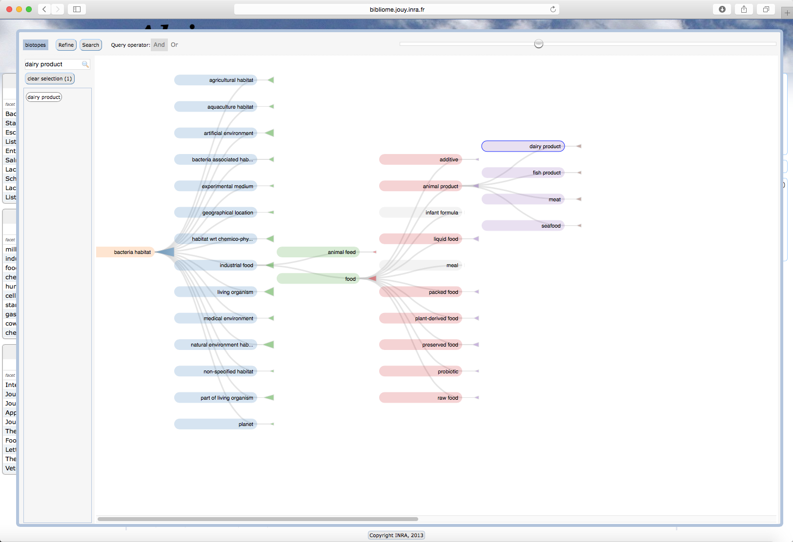
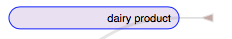
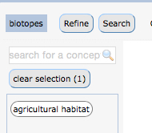
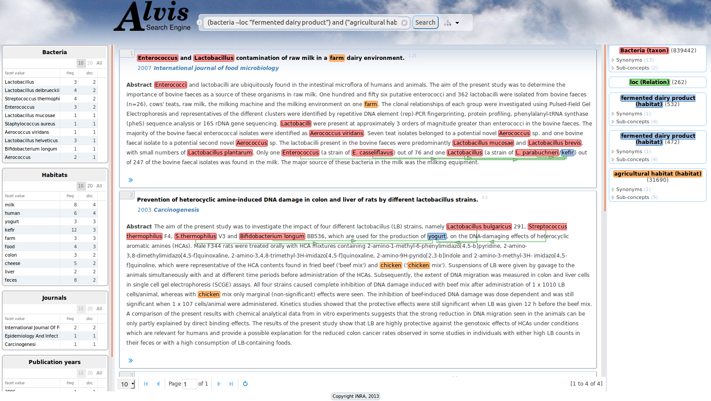

= Microbial Biodiversity

An initial page to introduce the application and it’s functionality

== Application goal

One of the main goal of the microbial biodiversity TDM use case is the completion of the knowledge described in databases with knowledge from the literature and other databases on microbial biodiversity, as well as their comparison for further analysis. A key knowledge in microbiology is the microbial biotope, its properties and the phenotypes of the microorganism. Most of this information is expressed in free text. Information content analysis and standardization calls for information extraction tools that can automatically analyze descriptions of microorganism biotopes so that biotope descriptions originating from different experiments can be compared at a large scale. Here analysis means not only the extraction of the relevant spans of text, but also the normalization or categorization with reference resources (e.g. taxonomy of organisms, ontology of habitat, ontology of phenotypes, ontology of physico-chemical properties, etc.).

== Application description

This version of the application consists of the automatic recognition and normalization of 1,6 million microorganism taxa and their 3,6 millions habitats and the automatic identification of 3,63 millions relationships between them. 
The corpus is composed of 1,16 million PubMed references. The taxa are normalized according to NCBI taxonomy. The habitats are normalized according to OntoBiotope Ontology.
The TDM components and the workflow application are deployed on Alvis platform at INRA MaIAGE lab. The end-user can use two front-end tools to search the extracted information a semantic search engine or a treemap builder. 
Alvis Semantic Information Retrieval engine is web application, publicly available usable with any web browser. 

= Microbial Biodiversity Search

A separate page for each ‘data processing scenario’ from the Application Design report for that application, outlining the execution of the scenario from the user’s perspective.

== User profile

The user of the microbial biodiversity search engine is a microbiologist that want to collect information about the type of environment where a bacteria or a class of bacteria live according to the literature. Conversely the microbiologist may want to collect the types of bacteria that live in a given environement.

== Architecture of the application

The relevant corpus has been fully pre-processed by AlvisNLP pipeline and indexed for query through AlvisIR engine available from any web browser.

== User manual, How-to

=== Launching the application

The URL to run AlvisIR search engine on Microbial Biodiversity is : 
http://bibliome.jouy.inra.fr/demo/pubmed-ontobiotope/alvisir/webapi/search?

[[img-sunset]]
// .AlvisIR search engine//
image::images/alvisIR_home.png[]

A click on the i at the left of the query field display a cheat sheet on the query language. 

[[img-sunset]]
//.A click//
image::resources/images/alvisIR_home_Aclick.png[]

=== Query

The query is typed in the query field.

[[img-sunset]]
// .The Query //

=== Results

The results of the query are displayed in four frames:

* the query interpretation (blue frame)
* the list of hits (pink frame)
* the facets (yellow frame)
* the page number (green frame).

[[img-sunset]]
// .The Results //

=== Query interpretation 

The query is interpreted according to the syntax of the query language. The terms of the query that designate bacteria taxa with respect to the NCBI taxonomy or habitats with respect to the OntoBiotope ontology are interpreted as concepts of these hierarchies. ~loc is interpreted as the "localization relation between the taxon term at left and the habitat term at right. 
The query interpretation frame displays the interpretation of query terms as concepts, the list of their synonyms and subconcepts (more specific). The number of occurrences for each term is also displayed. All documents that are indexed by a synonym or a more specific term of the query term are retrieved if they respect the relationship constraint if ever. 

=== Hits

Each hit represent a document that verify the query constraints. It is composed of 

* the title of the document, (click on the title display the full reference on PubMed site.)
* the publication date, 
* the name of the journal, 
* the text of the abstract and 
* the list of the indexes that is displayed by a click on the >> symbol.

The taxa and the habitat names are highlighted. The colour for each entity type corresponds to the colour of the query interpretation frame. A fine green line links the taxon to its habitats.

=== Facets

There is one facet table per index type: Microorganisms, Habitats and Journals. They give information about the set of retrieved hits. Each table gives the list of values, the total frequency and the number of documents. 10 (by default), 20 or all of them can be displayed. Click on any line refines the query: it adds to the query the term in the facet that has been selected.

=== Page number

The number of hits displayed per page can be 10, 20, 30 or 50. 

=== Habitat selection in the ontology

Click on the tree icon at the right of the Search button displays the OntoBiotope ontology that indexes the habitat and a query composer.

[[img-sunset]]
// .Habitat //
image::images/alvisIR_home_Habitat.png[align="center"]

The ontology window is composed of two parts:

* ontology navigation (pink frame)
* the query composer (yellow frame)

Click on the main window in the back  closes the ontology window without query composition, 

[[img-sunset]]
// .Ontology //

=== Ontology navigation

The levels of the ontology are displayed from the most general to the specific, from left to right. The triangle at the right of a concept name represent the size of the subtree it the root of. The surface of the triangle is proportional to the depth and the banching factor. Click on the triangle opens the subtree.

[[img-sunset]]
// .Ontology Nativation Traingle //

// .Ontology Nativation //
image::images/alvisIR_home_Ontology_Navigation.png[]

Zoom is done by using the sliding button on the top of the frame 

[[img-sunset]]
// .Ontology Zoom //
image::images/alvisIR_home_Ontology_Zoom.png[align="center"]

=== Query composer 

Click on the name of the concept adds it to the query that is displayed as a term stack. The two operators Or or And are available.

[[img-sunset]]

// .Query Composer //

Click on Refine button adds the terms to the currect query. Click on the Search button replace the current query by the new one.

[[img-sunset]]

// .Query Composer Results //

=== Further information

Alvis : https://github.com/Bibliome/alvisnlp
